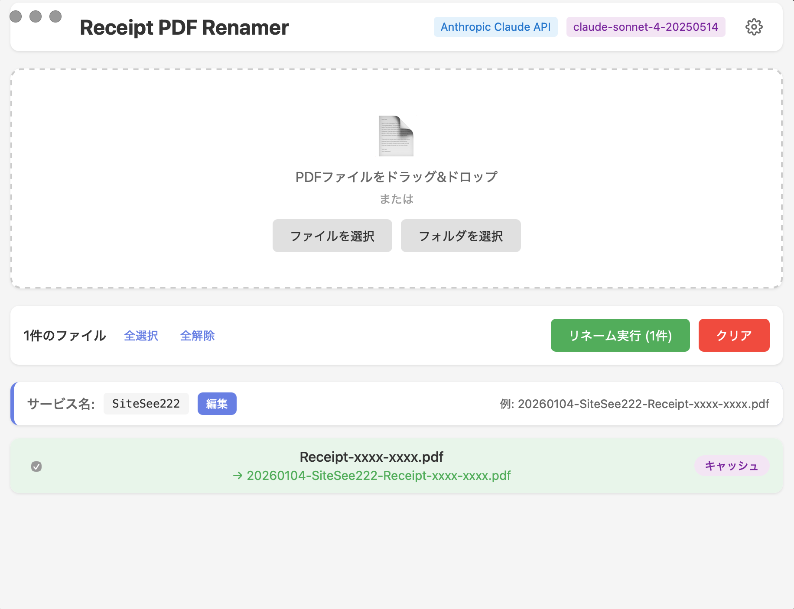

# receipt-pdf-renamer

領収書PDFファイルをAIで解析し、支払日とサービス名を抽出して自動リネームするデスクトップアプリ（macOS / Windows対応）。

## 特徴

- **GUIアプリ**: ドラッグ&ドロップでPDFファイルを追加
- **AI解析**: Anthropic Claude または OpenAI互換API（ローカルLLM対応）でPDFから情報を抽出
- **キャッシュ**: 解析結果をキャッシュして再実行を高速化
- **セキュア**: APIキーはOSのセキュアストレージに保存（macOS Keychain / Windows Credential Manager）

## スクリーンショット



## インストール

### ビルド済みバイナリ

[Releases](https://github.com/naotama2002/receipt-pdf-renamer/releases) からダウンロード

### ソースからビルド

```bash
# 必要条件（.tool-versions 参照）
# - Go 1.25+
# - Node.js 25+
# - pnpm 10+
# - Wails CLI (go install github.com/wailsapp/wails/v2/cmd/wails@latest)

git clone https://github.com/naotama2002/receipt-pdf-renamer.git
cd receipt-pdf-renamer

# フロントエンド依存インストール
make install-frontend

# 開発モード（ホットリロード）
make dev
```

### macOSアプリのビルド

```bash
# ビルド
make build

# または Universal Binary (Intel + Apple Silicon)
make build-mac
```

ビルド成果物: `build/bin/Receipt PDF Renamer.app`

**実行:**
```bash
open "build/bin/Receipt PDF Renamer.app"
```

**インストール:**
```bash
cp -r "build/bin/Receipt PDF Renamer.app" /Applications/
```

### Windowsアプリのビルド

```bash
# Windows用ビルド（Windowsマシン上で実行）
make build-win
```

ビルド成果物: `build/bin/receipt-pdf-renamer.exe`

**インストール:**
1. `build/bin/receipt-pdf-renamer.exe` を任意の場所にコピー（例: `C:\Program Files\Receipt PDF Renamer\`）
2. （オプション）右クリックメニュー登録: `build/windows/context-menu-install.reg` を編集してパスを修正後、ダブルクリックして実行

## 使い方

### 1. 初回設定

1. アプリを起動
2. 右上の歯車アイコンをクリック
3. AIプロバイダーとAPIキーを設定
   - **Anthropic**: claude-sonnet-4 または カスタムモデル
   - **OpenAI互換**: カスタムモデル + エンドポイントURL（ローカルLLM用）

### 2. PDFファイルの追加

**方法1: アプリ内から**
- ウィンドウにPDFをドラッグ&ドロップ
- または「ファイルを選択」「フォルダを選択」ボタンから選択

**方法2: OSから「このアプリで開く」**

*macOS:*
1. Finder で PDF ファイルを右クリック
2. 「このアプリケーションで開く」→「Receipt PDF Renamer」を選択
3. アプリが起動し、PDFがファイルリストに追加される
（初回は「その他...」から `/Applications/Receipt PDF Renamer.app` を選択）

*Windows:*
1. エクスプローラーで PDF ファイルを右クリック
2. 「プログラムから開く」→「Receipt PDF Renamer」を選択
3. アプリが起動し、PDFがファイルリストに追加される
（右クリックメニュー登録済みの場合は「Receipt PDF Renamerで開く」を選択）

### 3. 解析とリネーム

1. 「解析開始」ボタンでAI解析を実行
2. サービス名パターンを設定（例: `{{.Service}}` または固定文字列）
3. リネームするファイルを選択
4. 「リネーム実行」ボタンでリネーム

## 出力フォーマット

```
YYYYMMDD-{ServicePattern}-{OriginalName}.pdf
```

例: `20250101-Amazon-receipt-001.pdf`

- **YYYYMMDD**: 支払日（AIが抽出）
- **ServicePattern**: サービス名パターン（設定で編集可能）
- **OriginalName**: 元のファイル名

## 設定

### 設定ファイル

`~/.config/receipt-pdf-renamer/config.yaml`（GUIから自動管理）

```yaml
ai:
  provider: "anthropic"
  model: "claude-sonnet-4-20250514"
  base_url: ""  # OpenAI互換API用
  max_workers: 3

cache:
  enabled: true
  ttl: 0  # 0 = 無期限

format:
  service_pattern: "{{.Service}}"
  date_format: "20060102"
```

### APIキー

APIキーはOSのセキュアストレージに安全に保存されます。設定ファイルには保存されません。
- **macOS**: Keychain
- **Windows**: Credential Manager

## 対応AIプロバイダー

| プロバイダー | モデル | 用途 |
|------------|--------|------|
| Anthropic | claude-sonnet-4 / カスタム | Claude API |
| OpenAI互換 | カスタム | OpenAI API / ローカルLLM (Ollama, LM Studio等) |

### ローカルLLMの設定例

Ollamaを使用する場合:

1. プロバイダー: 「OpenAI互換」
2. モデル名: `llama3` (使用するモデル名)
3. エンドポイントURL: `http://localhost:11434/v1`

## 開発

```bash
# 開発サーバー起動
make dev

# ビルド
make build

# フォーマット
make fmt

# Lint
make lint
```

## 配布物の作成

```bash
# 両プラットフォーム用の配布物を作成
make dist

# macOS用のみ（DMGファイル）
make dist-mac

# Windows用のみ（ZIPファイル）
make dist-win
```

成果物は `dist/` ディレクトリに作成されます:
- `Receipt PDF Renamer-{version}-mac.dmg` - macOS用
- `receipt-pdf-renamer-{version}-win.zip` - Windows用

※ バージョンは git タグから取得されます（例: `v1.0.0`）

## 技術スタック

- **バックエンド**: Go + [Wails](https://wails.io/)
- **フロントエンド**: Svelte + TypeScript
- **APIキー管理**: [go-keyring](https://github.com/zalando/go-keyring) (macOS Keychain / Windows Credential Manager)

## ライセンス

MIT
